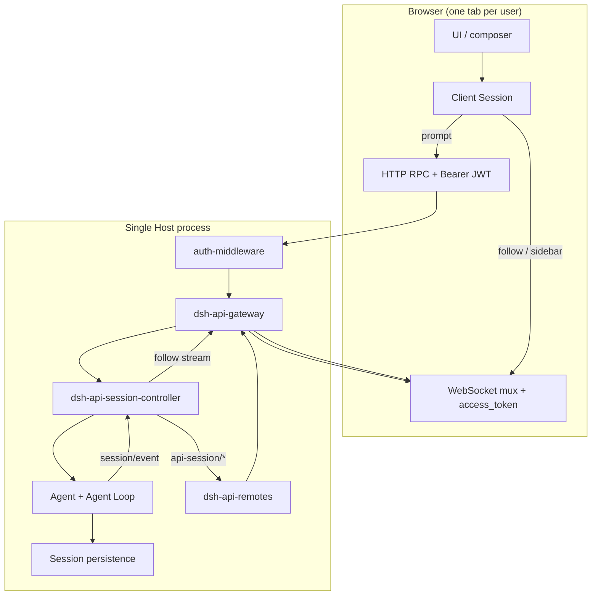
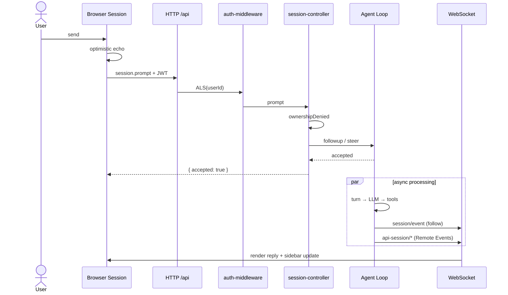

# Multi-user message processing flow

English | [中文](MESSAGE-FLOW.zh.md)

This page traces one browser prompt from send to rendered assistant output under the `dsh-multi-user` profile, and names the layers that enforce tenant isolation. For ownership rules and bundle composition, see the [same-process multi-tenant Agent Note](../../../.agents/notes/implemented/architecture/2026-08-27-same-process-multi-tenant.md).

## Overall architecture

Multi-user mode serves several authenticated users in one Host process. Sessions and related resources isolate on `SessionHeader.ownerUserId`. Prompts travel over HTTP `/api` (JWT enters `AsyncLocalStorage`); conversation content and sidebar state travel over the WebSocket mux (each connection carries `userId`; Remote events may carry `targetUserId`).



| Channel | Transport | Identity | Primary use |
|---------|-----------|----------|-------------|
| Unary RPC | HTTP POST `/api/...` | `Authorization: Bearer` → ALS | `session.prompt`, `session.create`, other writes |
| Stream RPC | WebSocket mux | `?access_token=` → connection `userId` | `session.follow`, Remote Event stream |
| Sidebar / control | WebSocket Remote Events | same + `targetUserId` filter | `api-session/*`, `approval/request`, etc. |

## Phase 0: Login and identity binding

1. The user signs in through [`dsh-client-ui-auth`](../../client/ui-auth/README.md); the JWT lands in `sessionStorage`.
2. **HTTP**: [`dsh-client-connection`](../../client/connection/README.md) attaches `Authorization: Bearer <jwt>` on every RPC; HTTP 401 clears the token and reopens login UI.
3. **WebSocket**: the [`dsh-api-gateway` client](../../api/gateway/src/client/stream-client.ts) adds `access_token` to the mux URL (browser upgrades cannot set custom headers).
4. **Host**: [`dsh-host-auth-middleware`](../../host/auth-middleware/README.md) verifies HS256 JWTs, stores `{ userId }` in `AsyncLocalStorage`, and returns 401 for unauthenticated `/api` except `/api/auth.exchange`.

## Phase 1: Client send

Call chain: `UI → Session.prompt() → remote.session.prompt() → POST /api/session.prompt`.

Behavior in [`packages/api/session-controller/src/client/sessions/session.ts`](../../api/session-controller/src/client/sessions/session.ts):

1. **Optimistic UI**: synchronously sets `promptAttempted` and renders a local submission echo (client-minted `requestId`).
2. **RPC payload**: `sessionId`, `mode` (`queue` | `steer`), `content`, optional `clientTimeZone`.
3. **Failure**: non-401 errors land in `promptError` and retire the echo; 401 triggers re-login.
4. **Success**: a blank Session flips to engaged only after the Host accepts the prompt (a rejected first prompt must not permanently clear blank state).

`queue` waits for the current turn; `steer` targets the next step of the current turn (see Agent Loop).

## Phase 2: Host prompt admission

### Gateway routing

```
POST /api/session.prompt
  → auth-middleware (ALS binds principal)
  → connection.rpc.intercept('/api')
  → typertGateway.invoke()
  → SessionController.prompt()
```

`prompt` is a unary RPC; the full call stays in the HTTP middleware ALS context.

### Ownership check

[`SessionCommandController.prompt`](../../api/session-controller/src/commands.ts) resolves a live Agent via `resolveAgent(sessionId)`; cold Sessions resume first, then [`ownershipDenied`](../../api/session-controller/src/ownership.ts) runs:

| Condition | Result |
|-----------|--------|
| No auth middleware (single-user) | allow |
| Session has no `ownerUserId` | allow |
| `principal.userId === header.ownerUserId` | allow |
| otherwise | `session/unauthorized` |

User A cannot prompt User B's Session.

### Admission

After ownership passes:

1. Validate `clientTimeZone` and that the Session's model route is served;
2. When images are present, validate model `inputModalities` and attachment policy;
3. Build a `UserMessage` with `source.kind = 'user'` and `rpcId` (echo reconciliation);
4. `mode === 'steer'` → `agent.steer(message)`; else → `agent.followup(message)`;
5. Return `{ accepted: true }` synchronously (message is in the Agent inbox; not yet in the session log).

On create, [`ApiSessionAgentController`](../../api/session-controller/src/agent.ts) stamps `getPrincipal(ctx)?.userId` into `SessionHeader.ownerUserId`; [`ApiSessionList.list`](../../api/session-controller/src/list.ts) filters by owner.

## Phase 3: Agent processing (per Session)

Each Session owns one Agent (`sessionId === agent.id`). Concurrent users run independent loops, inboxes, and session logs.

### Enqueue and wake

[`packages/core/agent-loop/src/agent.ts`](../../core/agent-loop/src/agent.ts):

- `followup` → `next-turn` inbox + `wakeDriver`;
- `steer` → `next-step` inbox + `wakeDriver`.

### Loop and session log

Typical turn sequence:

```mermaid
sequenceDiagram
  participant Inbox as Agent Inbox
  participant Loop as Agent Loop
  participant Log as Session Log
  participant LLM as LLM
  participant Tools as Tools

  Inbox->>Loop: claim user message
  Loop->>Log: turn/start
  Loop->>Log: step/start
  Loop->>Log: user/message
  Loop->>LLM: assemble + request
  LLM-->>Loop: assistant output
  Loop->>Log: assistant/* events
  opt tool calls
    Loop->>Tools: execute
    Tools-->>Loop: result
    Loop->>Log: tool/* events
  end
  Loop->>Log: step/end
  Loop->>Log: turn/end
```

User messages enter the log at `session.append('user/message', ...)` (model-visible ⟺ logged).

### Concurrent isolation

| Dimension | Mechanism |
|-----------|-----------|
| Session identity | distinct `sessionId` / Agent instance |
| Pending work | per-Agent inbox |
| Durability | events append only to owning Session |
| Tool paths | [`dsh-user-path-policy`](../../sandbox/user-path-policy/README.md) confines absolute paths to `$DSH_HOME/workspaces/<ownerUserId>/` |

Multiple users prompting at once do **not** mix messages at the model or inbox layer.

## Phase 4: Host event broadcast

[`SessionController`](../../api/session-controller/src/index.ts) maps Cordis lifecycle to application events:

| Cordis / Agent | Application event | Typical trigger |
|----------------|-------------------|-----------------|
| `session/created` | `api-session/added` | Session visible |
| `session/disposed` | `api-session/removed` | Session torn down |
| `agent/status` | `api-session/status` | running changes |
| `session/event` (user/message) | `api-session/activity` | durable user message time |
| `agent/error` | `api-session/error` | Agent failure |

[`dsh-api-remotes`](../../api/remotes/src/index.ts) forwards emit events and attaches `targetUserId` for tenant-bounded names (maintains `sessionId → ownerUserId`; `added` reads `SessionSummary.ownerUserId`; waterfall events resolve owner from Agent id).

[`dsh-api-gateway`](../../api/gateway/src/index.ts) `broadcastRemoteEvent` and waterfall delivery: when a frame carries `targetUserId`, only WebSocket clients whose connection `userId` matches receive it; unauthenticated single-user connections still receive all broadcasts.

Deployment-wide events remain globally broadcast (no per-user filter): `llm/adapters-updated`, `commands/change`, `settings/document-updated`, `cordis/*`, etc. (see entries in [`remote-events.ts`](../../api/remotes/src/remote-events.ts) that do not receive `targetUserId`).

### Host-wide control stream: `session.control` (`queue` / `projection` / `jobs`)

The browser also opens a Host-wide **`session.control`** WebSocket stream on connect (see [`createSessionControlStream`](../../api/session-controller/src/client/transport.ts)). It carries:

| `type` | Payload |
|--------|---------|
| `baseline` | queue, jobs, and projection snapshots for every visible Session |
| `queue` | pending inbox user messages for one Session (includes `content`) |
| `projection` | Session projection key updates |
| `jobs` | background job list changes |

A user prompt triggers `agent/inbox/spliced` → a **`queue` frame**; projection changes → **`projection` frames**. This is a **separate WebSocket channel** from Remote Events; filtering Remote Events alone does not stop `queue`/`projection` leakage.

In multi-user mode:

1. The browser opens the control stream with an empty `{}` request;
2. [`dsh-api-gateway`](../../api/gateway/src/index.ts) injects `viewerUserId` into the `session/control` wire `args.request` when the WebSocket upgrade already knows `userId`;
3. [`SessionControlController`](../../api/session-controller/src/control.ts) filters baselines and live `queue` / `projection` / `jobs` frames to Sessions whose `header.ownerUserId` is unset or matches the viewer.

Sessions without `ownerUserId` (legacy single-user data) remain visible to every authenticated viewer, matching the list API rule.

## Phase 5: Client receive and render

### Conversation: `session.follow`

After the user selects a Session, [`Session.open()`](../../api/session-controller/src/client/sessions/session.ts) opens a follow stream:

1. Host [`SessionHistoryController.follow`](../../api/session-controller/src/history.ts) yields a snapshot (header, history records, projections);
2. Subscribes to global `session/event`, buffering only that `sessionId`;
3. Pushes gap-free frames by `seq`;
4. Client updates `eventSource`; Conversation UI renders assistant text and tool cards.

### Sidebar: Remote Event stream

The [`session-controller` Client plugin](../../api/session-controller/src/client/index.ts) registers:

- `api-session/added` → `handleSessionAdded`
- `api-session/removed` → `handleSessionRemoved`
- `api-session/status` → running indicator
- `api-session/activity` → list sort time
- `api-session/error` → error strip

After one user prompt, typical order: `status(true)` → follow append (user/assistant events) → `activity` → `status(false)`.

## End-to-end sequence (one user, one message)



## Concurrent multi-user behavior

User A (Session SA) and User B (Session SB) prompt together:

| Step | User A | User B |
|------|--------|--------|
| HTTP prompt | ALS = A; SA.owner = A | ALS = B; SB.owner = B |
| Agent | Agent SA loop | Agent SB loop |
| Session log | SA only | SB only |
| follow | A's browser follows SA | B's browser follows SB |
| Sidebar events | `targetUserId = A` | `targetUserId = B` |
| Control stream | only SA `queue`/`projection` | only SB `queue`/`projection` |

## Boundaries and limitations

1. **Writes are stricter than some reads**: `prompt` and `create` enforce owner under HTTP + ALS; Gateway re-enters ALS from the connection `userId` on each mux logical-stream pull (so `workspace.follow` default Workspace provision can read the principal). `session.follow` may return a snapshot before background `promote()` surfaces unauthorized. Normal UI follows only listed owned Sessions.
2. **Workspaces**: [`workspace-controller`](../../api/workspace-controller/README.md) filters by `ownerUserId`; `dsh-multi-user` auto-registers `$DSH_HOME/workspaces/<userId>/default` on the first authenticated `workspace.follow` when the user has no Workspace yet.
3. **Credentials and settings**: the multi-user bundle keeps credentials read-only and routes settings writes to per-user overlays (see the [same-process multi-tenant Agent Note](../../../.agents/notes/implemented/architecture/2026-08-27-same-process-multi-tenant.md)).

## Related packages

| Package | Role |
|---------|------|
| [`dsh-host-auth-middleware`](../../host/auth-middleware/README.md) | JWT verification, ALS principal |
| [`dsh-host-auth-login`](../../host/auth-login/README.md) | IdP → DSH JWT |
| [`dsh-client-ui-auth`](../../client/ui-auth/README.md) | Login UI |
| [`dsh-client-connection`](../../client/connection/README.md) | RPC + JWT attachment |
| [`dsh-api-gateway`](../../api/gateway/README.md) | RPC/stream routing, Remote Event filter |
| [`dsh-api-remotes`](../../api/remotes/README.md) | Host event forwarding, `targetUserId` |
| [`dsh-api-session-controller`](../../api/session-controller/README.md) | Session API, ownership, follow |
| [`dsh-user-path-policy`](../../sandbox/user-path-policy/README.md) | per-user tool path bound |
