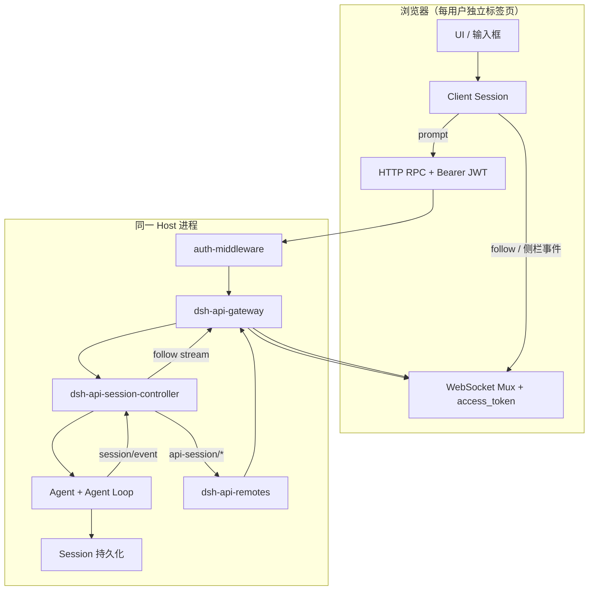
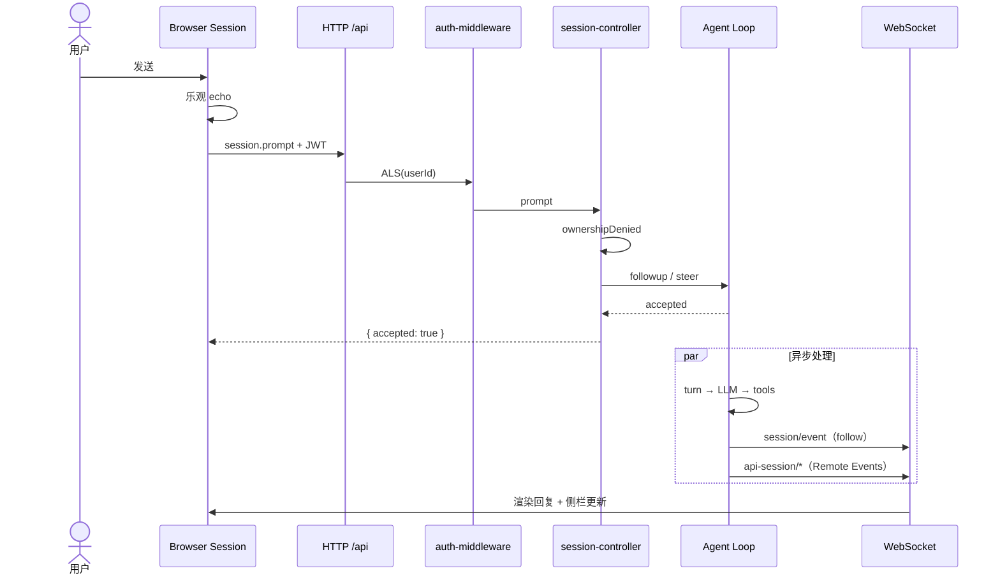

# 多用户消息处理流程

[English](MESSAGE-FLOW.md) | 中文

本文描述 `dsh-multi-user` profile 下，用户从浏览器发送一条 prompt 到 UI 收到智能体回复的完整路径，以及多租户隔离发生在哪些层。所有权与 bundle 组成见 [同进程多租户 Agent Note](../../../.agents/notes/implemented/architecture/2026-08-27-same-process-multi-tenant.zh.md)。

## 总体架构

多用户模式在同一 Host 进程内服务多个已认证用户，按 `SessionHeader.ownerUserId` 隔离会话与相关资源。发送消息走 HTTP `/api`（JWT 进入 `AsyncLocalStorage`）；接收会话内容与侧栏状态走 WebSocket mux（连接绑定 `userId`，Remote 事件可按 `targetUserId` 过滤）。



| 通道 | 传输 | 用户身份 | 主要用途 |
|------|------|----------|----------|
| Unary RPC | HTTP POST `/api/...` | `Authorization: Bearer` → ALS | `session.prompt`、`session.create` 等写操作 |
| Stream RPC | WebSocket mux | `?access_token=` → 连接 `userId` | `session.follow`、Remote Event 流 |
| 侧栏/控制 | WebSocket Remote Events | 同上 + `targetUserId` 过滤 | `api-session/*`、`approval/request` 等 |

## 阶段 0：登录与身份绑定

1. 用户经 [`dsh-client-ui-auth`](../../client/ui-auth/README.zh.md) 登录；JWT 写入 `sessionStorage`。
2. **HTTP**：[`dsh-client-connection`](../../client/connection/README.zh.md) 在每个 RPC 请求头附加 `Authorization: Bearer <jwt>`；401 时清除 token 并重新展示登录 UI。
3. **WebSocket**：[`dsh-api-gateway` 客户端](../../api/gateway/src/client/stream-client.ts) 在 mux URL 上附加 `access_token` query（浏览器 upgrade 无法自定义 Header）。
4. **Host**：[`dsh-host-auth-middleware`](../../host/auth-middleware/README.zh.md) 校验 HS256 JWT，将 `{ userId }` 写入 `AsyncLocalStorage`；除 `/api/auth.exchange` 外，未认证 `/api` 返回 401。

## 阶段 1：客户端发送消息

调用链：`UI → Session.prompt() → remote.session.prompt() → POST /api/session.prompt`。

[`packages/api/session-controller/src/client/sessions/session.ts`](../../api/session-controller/src/client/sessions/session.ts) 中的行为：

1. **乐观 UI**：同步设置 `promptAttempted`，渲染本地 submission echo（`requestId` 由客户端 mint）。
2. **RPC 载荷**：`sessionId`、`mode`（`queue` | `steer`）、`content`、`clientTimeZone`（可选）。
3. **失败**：非 401 错误写入 `promptError` 并 retire echo；401 触发重新登录。
4. **成功**：Host 接受 prompt 后，blank Session 才转为 engaged（避免拒绝的首条消息永久改变 blank 状态）。

`queue` 在当前 turn 结束后处理；`steer` 尽量插入当前 turn 的下一步（见 Agent Loop）。

## 阶段 2：Host 接收 prompt

### Gateway 路由

```
POST /api/session.prompt
  → auth-middleware（ALS 绑定 principal）
  → connection.rpc.intercept('/api')
  → typertGateway.invoke()
  → SessionController.prompt()
```

`prompt` 是 unary RPC，全程在 HTTP 中间件的 ALS 上下文中，可读取当前用户。

### 所有权校验

[`SessionCommandController.prompt`](../../api/session-controller/src/commands.ts) 通过 `resolveAgent(sessionId)` 获取 live Agent；若 Session 冷启动则 resume，完成后调用 [`ownershipDenied`](../../api/session-controller/src/ownership.ts)：

| 条件 | 结果 |
|------|------|
| 未 compose auth middleware（单用户） | 放行 |
| Session 无 `ownerUserId` | 放行 |
| `principal.userId === header.ownerUserId` | 放行 |
| 否则 | `session/unauthorized` |

用户 A 无法向用户 B 拥有的 Session 发送 prompt。

### Prompt 准入

通过 ownership 后：

1. 校验 `clientTimeZone`、当前 Session 模型路由是否可用；
2. 含图片时校验模型 `inputModalities` 与附件策略；
3. 构造 `UserMessage`，`source.kind = 'user'`，携带 `rpcId`（与客户端 echo 对齐）；
4. `mode === 'steer'` → `agent.steer(message)`；否则 → `agent.followup(message)`；
5. 同步返回 `{ accepted: true }`（消息已进入 Agent inbox，尚未写入 session log）。

新建 Session 时，[`ApiSessionAgentController`](../../api/session-controller/src/agent.ts) 将 `getPrincipal(ctx)?.userId` 写入 `SessionHeader.ownerUserId`；列表 API 在 [`ApiSessionList.list`](../../api/session-controller/src/list.ts) 中按 owner 过滤。

## 阶段 3：Agent 处理（按 Session 隔离）

每个 Session 对应一个 Agent（`sessionId === agent.id`）。多用户并发时，不同 Session 的 loop、inbox、session log 互不共享。

### 入队与唤醒

[`packages/core/agent-loop/src/agent.ts`](../../core/agent-loop/src/agent.ts)：

- `followup` → `next-turn` inbox，并 `wakeDriver`；
- `steer` → `next-step` inbox，并 `wakeDriver`。

### Loop 与 session log

典型 turn 序列：

```mermaid
sequenceDiagram
  participant Inbox as Agent Inbox
  participant Loop as Agent Loop
  participant Log as Session Log
  participant LLM as LLM
  participant Tools as Tools

  Inbox->>Loop: claim 用户消息
  Loop->>Log: turn/start
  Loop->>Log: step/start
  Loop->>Log: user/message
  Loop->>LLM: 组装 prompt + 请求
  LLM-->>Loop: assistant 输出
  Loop->>Log: assistant/* 事件
  opt 工具调用
    Loop->>Tools: 执行
    Tools-->>Loop: 结果
    Loop->>Log: tool/* 事件
  end
  Loop->>Log: step/end
  Loop->>Log: turn/end
```

用户消息写入 log 的位置：`session.append('user/message', ...)`（model-visible ⟺ logged）。

### 并发隔离

| 维度 | 机制 |
|------|------|
| 会话身份 | 独立 `sessionId` / Agent 实例 |
| 待处理队列 | 每 Agent 私有 inbox |
| 持久化 | 事件只 append 到所属 Session |
| 工具路径 | [`dsh-user-path-policy`](../../sandbox/user-path-policy/README.zh.md) 将绝对路径限制在 `$DSH_HOME/workspaces/<ownerUserId>/` |

因此多用户同时发消息时，**不会在模型请求或 inbox 层串线**。

## 阶段 4：Host 事件广播

[`SessionController`](../../api/session-controller/src/index.ts) 将 Cordis 生命周期映射为应用层事件：

| Cordis / Agent | 应用事件 | 典型时机 |
|----------------|----------|----------|
| `session/created` | `api-session/added` | 新 Session 可见 |
| `session/disposed` | `api-session/removed` | Session 销毁 |
| `agent/status` | `api-session/status` | running 变化 |
| `session/event`（user/message） | `api-session/activity` | 用户消息 durable 时间 |
| `agent/error` | `api-session/error` | Agent 失败 |

[`dsh-api-remotes`](../../api/remotes/src/index.ts) 转发上述 emit 事件，并为租户边界事件附加 `targetUserId`（维护 `sessionId → ownerUserId` 映射；`added` 从 `SessionSummary.ownerUserId` 读取；waterfall 事件从 Agent id 解析 owner）。

[`dsh-api-gateway`](../../api/gateway/src/index.ts) 的 `broadcastRemoteEvent` 与 waterfall 投递：当 frame 带 `targetUserId` 时，仅推送给 WebSocket 连接上 `userId` 匹配的客户端；无 `userId` 的单用户连接仍接收全部广播。

仍全局广播（部署级、不按用户过滤）的事件包括：`llm/adapters-updated`、`commands/change`、`settings/document-updated`、`cordis/*` 等（见 [`remote-events.ts`](../../api/remotes/src/remote-events.ts) 中未打 `targetUserId` 的条目）。

### 全局控制流：`session.control`（`queue` / `projection` / `jobs`）

浏览器在连接建立后还会打开一条 Host 级 **`session.control`** WebSocket 流（见 [`createSessionControlStream`](../../api/session-controller/src/client/transport.ts)）。该流推送：

| `type` | 内容 |
|--------|------|
| `baseline` | 所有可见 Session 的 queue、jobs、projection 快照 |
| `queue` | 某 Session inbox 的待处理用户消息（含 `content`） |
| `projection` | Session projection 键值更新 |
| `jobs` | 后台 job 列表变化 |

用户发消息会触发 `agent/inbox/spliced` → **`queue` 帧**；projection 变更 → **`projection` 帧**。这与 Remote Event 流是**另一条 WebSocket 通道**；仅过滤 Remote Event 无法挡住 `queue`/`projection` 泄漏。

多用户模式下：

1. 浏览器打开 control 流时发送空 `{}` 请求；
2. [`dsh-api-gateway`](../../api/gateway/src/index.ts) 在 WebSocket upgrade 已知 `userId` 时，向 `session/control` 的 wire `args.request` 注入 `viewerUserId`；
3. [`SessionControlController`](../../api/session-controller/src/control.ts) 按 `viewerUserId` 过滤 baseline 与后续 `queue` / `projection` / `jobs` 帧，只包含 `header.ownerUserId` 为空或与 viewer 相同的 Session。

无 `ownerUserId` 的 Session（单用户遗留数据）对所有已认证 viewer 仍可见，与列表 API 规则一致。

## 阶段 5：客户端接收与渲染

### 对话内容：`session.follow`

用户选中 Session 后 [`Session.open()`](../../api/session-controller/src/client/sessions/session.ts) 打开 follow 流：

1. Host [`SessionHistoryController.follow`](../../api/session-controller/src/history.ts) 返回 snapshot（header、历史 records、projections）；
2. 订阅全局 `session/event`，仅缓冲该 `sessionId` 的新事件；
3. 按 `seq` _gap-free 推送给客户端；
4. Client 更新 `eventSource`，Conversation UI 渲染 assistant 文本与 tool 卡片。

### 侧栏与列表：Remote Event 流

[`session-controller` Client 插件](../../api/session-controller/src/client/index.ts) 注册：

- `api-session/added` → `handleSessionAdded`
- `api-session/removed` → `handleSessionRemoved`
- `api-session/status` → running 指示
- `api-session/activity` → 列表排序时间
- `api-session/error` → 错误条

用户发一条消息后，典型事件顺序：`status(true)` → follow 流 append（user/assistant 事件）→ `activity` → `status(false)`。

## 端到端时序（单用户一条消息）



## 多用户并发

用户 A（Session SA）、用户 B（Session SB）同时发送时：

| 步骤 | 用户 A | 用户 B |
|------|--------|--------|
| HTTP prompt | ALS = A；校验 SA.owner = A | ALS = B；校验 SB.owner = B |
| Agent | Agent SA 独立 loop | Agent SB 独立 loop |
| Session log | 仅 SA | 仅 SB |
| follow | A 的浏览器订阅 SA | B 的浏览器订阅 SB |
| 侧栏事件 | `targetUserId = A` | `targetUserId = B` |
| control 流 | 仅 SA 的 `queue`/`projection` | 仅 SB 的 `queue`/`projection` |

## 边界与限制

1. **写操作鉴权强于部分读路径**：`prompt`、`create` 等在 HTTP + ALS 下严格校验 owner；Gateway 在 mux 逻辑流每次拉取时用连接 `userId` 重入 ALS（如 `workspace.follow` 的默认 Workspace provision）。`session.follow` 在知道 `sessionId` 时可能先返回 snapshot，后台 `promote()` 才暴露 unauthorized。正常 UI 只 follow 列表中的自有 Session。
2. **工作区**：[`workspace-controller`](../../api/workspace-controller/README.zh.md) 按 `ownerUserId` 过滤；`dsh-multi-user` 在首次已鉴权 `workspace.follow` 时若用户尚无 Workspace，则自动登记 `$DSH_HOME/workspaces/<userId>/default`。
3. **凭据与设置**：多用户 bundle 下凭据只读、设置写入 per-user overlay（见 [同进程多租户 Agent Note](../../../.agents/notes/implemented/architecture/2026-08-27-same-process-multi-tenant.zh.md)）。

## 相关包

| 包 | 职责 |
|----|------|
| [`dsh-host-auth-middleware`](../../host/auth-middleware/README.zh.md) | JWT 校验、ALS principal |
| [`dsh-host-auth-login`](../../host/auth-login/README.zh.md) | IdP → DSH JWT |
| [`dsh-client-ui-auth`](../../client/ui-auth/README.zh.md) | 登录 UI |
| [`dsh-client-connection`](../../client/connection/README.zh.md) | RPC + JWT 附加 |
| [`dsh-api-gateway`](../../api/gateway/README.zh.md) | RPC/stream 路由、Remote Event 过滤 |
| [`dsh-api-remotes`](../../api/remotes/README.zh.md) | Host 事件转发、`targetUserId` |
| [`dsh-api-session-controller`](../../api/session-controller/README.zh.md) | Session API、ownership、follow |
| [`dsh-user-path-policy`](../../sandbox/user-path-policy/README.zh.md) | 工具路径 per-user 边界 |
